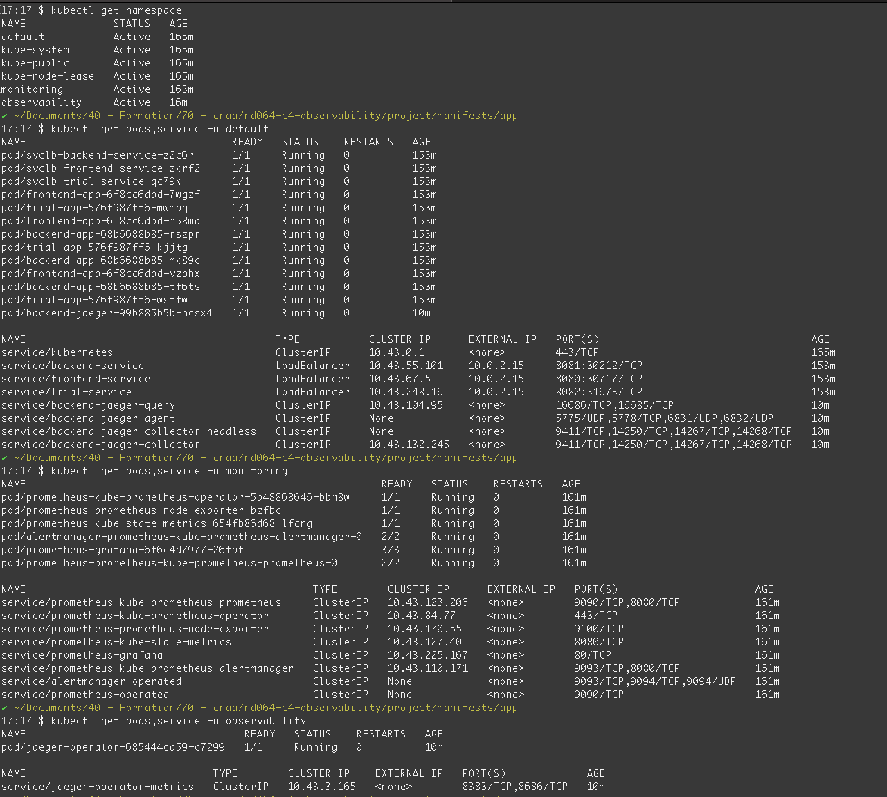
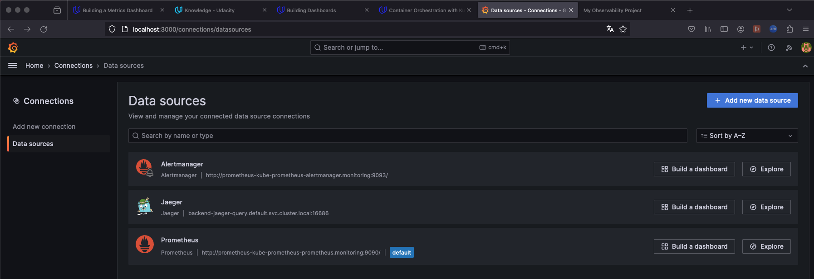
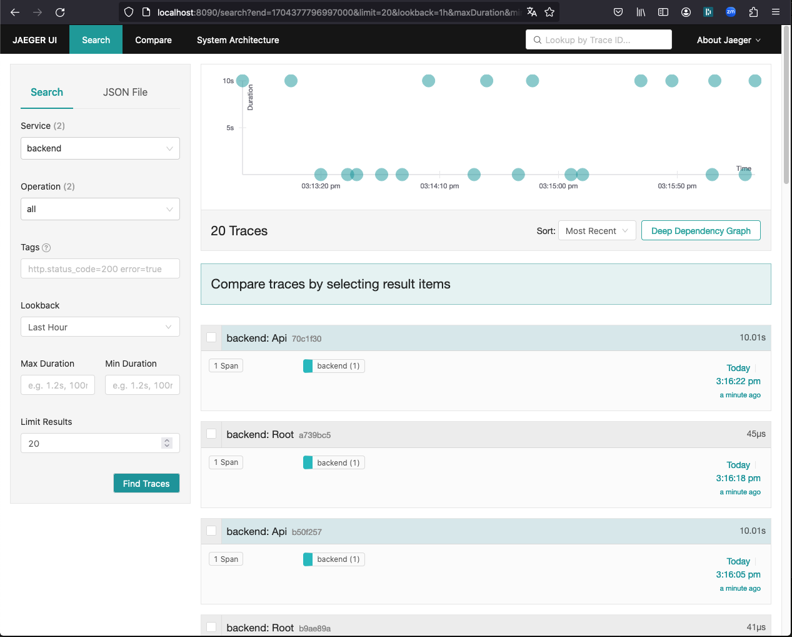
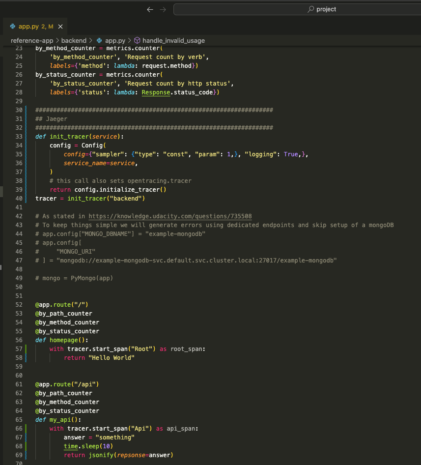
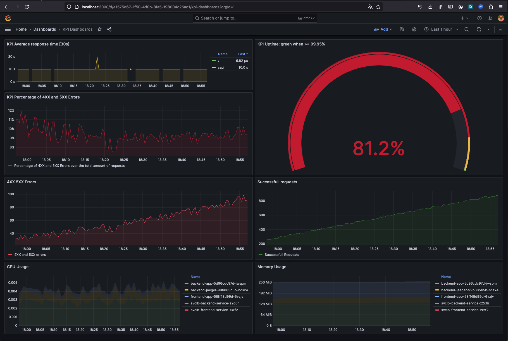

**Note:** For the screenshots, you can store all of your answer images in the `answer-img` directory.

## Verify the monitoring installation
*TODO:* run `kubectl` command to show the running pods and services for all components. Take a screenshot of the output and include it here to verify the installation

## Setup the Jaeger and Prometheus source
*TODO:* Expose Grafana to the internet and then setup Prometheus as a data source. Provide a screenshot of the home page after logging into Grafana.

## Create a Basic Dashboard
*TODO:* Create a dashboard in Grafana that shows Prometheus as a source. Take a screenshot and include it here.

## Describe SLO/SLI
*TODO:* Describe, in your own words, what the SLIs are, based on an SLO of *monthly uptime* and *request response time*.

* for a SLO "Monthly uptime must be at least X% for period of a month", the SLI vould be the cumulated uptime of the given service over that month.

* for a SLO "Request response time must be max X ms", the SLI would be the response time of all requests over the given period. It means that our imput signal is Latency.
## Creating SLI metrics.
*TODO:* It is important to know why we want to measure certain metrics for our customer. Describe in detail 5 metrics to measure these SLIs. 

  1. Request response time in seconds. This metric will be needed to assess response time
  2. Service uptime. 
  3. HTTP Requests/second. This metric will help us to identify response time issues due to traffic intensity
  4. Request getting 5XX Error status. this metric will allow us to eventually adjust uptime calculated by prometheus and substract significant period of time when requests all get in error.
  5. Percentage of CPU/memory used. This metric help us to identify response time or downtime issues due to CPU or memory underallocaion
  
## Create a Dashboard to measure our SLIs
*TODO:* Create a dashboard to measure the uptime of the frontend and backend services We will also want to measure to measure 40x and 50x errors. Create a dashboard that show these values over a 24 hour period and take a screenshot.

## Tracing our Flask App
*TODO:*  We will create a Jaeger span to measure the processes on the backend. Once you fill in the span, provide a screenshot of it here. Also provide a (screenshot) sample Python file containing a trace and span code used to perform Jaeger traces on the backend service.

## Jaeger in Dashboards
*TODO:* Now that the trace is running, let's add the metric to our current Grafana dashboard. Once this is completed, provide a screenshot of it here.

## Report Error
*TODO:* Using the template below, write a trouble ticket for the developers, to explain the errors that you are seeing (400, 500, latency) and to let them know the file that is causing the issue also include a screenshot of the tracer span to demonstrate how we can user a tracer to locate errors easily.

TROUBLE TICKET

Name:           Guillaume

Date:           January 4th 2024

Subject:        GET /api reauests are toot latency is too high

Affected Area:  Bakedn service

Severity:       High

Description:    Jaeger span "backend: Api" shows mostly request latnecy higher than 10 seconds, which is nuch too high.
                See 

## Creating SLIs and SLOs
*TODO:* We want to create an SLO guaranteeing that our application has a 99.95% uptime per month. Name four SLIs that you would use to measure the success of this SLO.

  1. **Uptime**: measures system availability, indicating the amount of time it is serving requests.
  2. **Errors**: Indicates 4XX and 5XX Errors.
  3. **Latency**: Indicates the response time for successful requests.
  4. **Saturation**: usage of computing resources: CPU/memory.

## Building KPIs for our plan
*TODO*: Now that we have our SLIs and SLOs, create a list of 2-3 KPIs to accurately measure these metrics as well as a description of why those KPIs were chosen. We will make a dashboard for this, but first write them down here.

  1. **KPI 1**: Average uptime on a floating period of 24 hours. (uptime in seconds during the last 24 hours/ 86400) * 100
  2. **KPI 2**: Percentage of 4XX and 5XX Errors over the total amount of requests
  3. **KPI 3**: Average response time for successful requests

## Final Dashboard
*TODO*: Create a Dashboard containing graphs that capture all the metrics of your KPIs and adequately representing your SLIs and SLOs. Include a screenshot of the dashboard here, and write a text description of what graphs are represented in the dashboard.  

In this dashboard we have one panel for each previously defined KPI.
Additionaly there are 2 panels showing error and successfull requests, these signals are used to calculate KPI 2
And least thare are 2 panels with saturation indication: CPU and memory usage